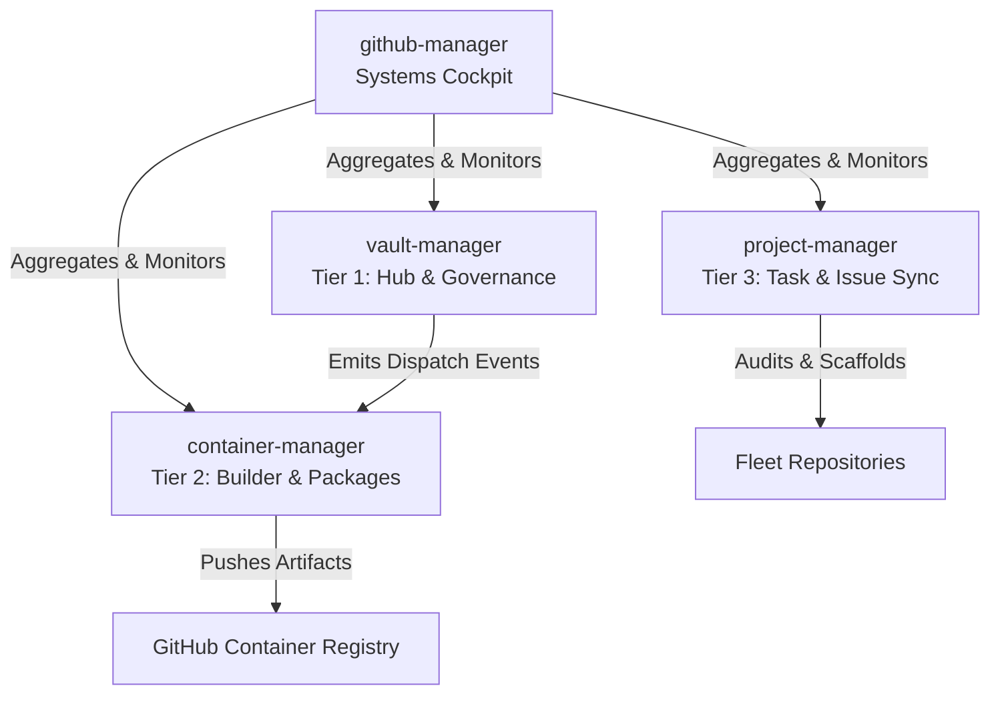

# 🎮 GitHub Manager — Systems Control Cockpit

Welcome to the **github-manager** command center. This repository serves as the high-level orchestration hub and digital nervous system for the **RPDevs-Vault** organization, overseeing a fleet of 260+ repositories and automated workflows.

---

## 🏛️ Manager Fleet Architecture

The management infrastructure of the RPDevs-Vault is organized into a tiered system to separate governance, package compilation, task tracking, and global health monitoring:

| Manager | Role / Tier | Key Functions | Repository Link |
| :--- | :--- | :--- | :--- |
| **`vault-manager`** | **Tier 1 (The Hub)** | Org governance, automated daily fork sync, merged branch cleanup, issue label standardization, stale fork auditing, notification control. | [vault-manager](https://github.com/RPDevs-Vault/vault-manager) |
| **`container-manager`** | **Tier 2 (The Builder)** | Compilation registry, multi-platform Docker builds, OCI package mirroring, disk housekeeping, self-hosted runner base image generation. | [container-manager](https://github.com/RPDevs-Vault/container-manager) |
| **`github-manager`** | **Tier 0 (The Cockpit)** | Global health dashboard, self-hosted runner configurations (`llmadmin` & `t430` pools), organization rate-limit monitoring, infrastructure docker-composes. | [github-manager](https://github.com/RPDevs-Vault/github-manager) |
| **`project-manager`** | **Tier 3 (The Sync)** | Local workstation project scanner/auditor/scaffolder, organization-wide issue collector, active task dashboard, development milestone tracking. | [project-manager](https://github.com/RPDevs-Vault/project-manager) |

---

## 📡 Live System Health Dashboard

The section below is automatically compiled and updated every 6 hours by the [Global Health Dashboard](.github/workflows/global-health.yml) workflow utilizing `aggregate_health.py`.

<!-- HEALTH_DASHBOARD_START -->

Last Updated: `2026-07-03 08:25:14 UTC`

### 🔑 API Rate Limits
- **Core Rate Limit:** `4992/5000` (99.8% remaining)
- **Reset Time:** `09:12:51 UTC`

### 🖥️ Self-Hosted Runner Fleet
| Runner Name | OS | Status | Labels |
| :--- | :--- | :--- | :--- |
| `local-runner-01` | Linux | 🟢 Online | `X64, local, linux64` |

### 📦 Manager Workflows Health
| Repository | Workflow | Status | Conclusion | Run Link | Last Run |
| :--- | :--- | :--- | :--- | :--- | :--- |
| `vault-manager` | Streamline Notifications | ✅ `completed` | `success` | [Run #22](https://github.com/RPDevs-Vault/vault-manager/actions/runs/28640842976) | 2026-07-03 05:38 UTC |
| `vault-manager` | Sync All Forks | ✅ `completed` | `success` | [Run #20](https://github.com/RPDevs-Vault/vault-manager/actions/runs/28636561562) | 2026-07-03 03:32 UTC |
| `vault-manager` | .github/workflows/archive-engine.yml | ❌ `completed` | `failure` | [Run #7](https://github.com/RPDevs-Vault/vault-manager/actions/runs/28565557128) | 2026-07-02 04:31 UTC |
| `vault-manager` | .github/workflows/health-dashboard.yml | ❌ `completed` | `failure` | [Run #6](https://github.com/RPDevs-Vault/vault-manager/actions/runs/28565556882) | 2026-07-02 04:31 UTC |
| `container-manager` | Fleet Status Aggregator | ✅ `completed` | `success` | [Run #12](https://github.com/RPDevs-Vault/container-manager/actions/runs/28642604800) | 2026-07-03 06:23 UTC |
| `container-manager` | Docker Collector | ✅ `completed` | `success` | [Run #32](https://github.com/RPDevs-Vault/container-manager/actions/runs/28636565388) | 2026-07-03 03:33 UTC |
| `container-manager` | Dependency Build Engine | ❌ `completed` | `failure` | [Run #9](https://github.com/RPDevs-Vault/container-manager/actions/runs/28635655224) | 2026-07-03 04:38 UTC |
| `RPDevs-Vault/github-manager` | *No runs discovered* | - | - | - | - |
| `RPDevs-Vault/project-manager` | *No runs discovered* | - | - | - | - |

<!-- HEALTH_DASHBOARD_END -->

---

## 🛠️ Advanced GitHub Features Leveraged

To manage the organization efficiently and prevent API rate-limiting while maintaining strict security, we utilize the following native features:

1. **Repository Dispatches (Event Framework):**
   - Instead of polling git repos for changes, `vault-manager` emits a `repository_dispatch` to `container-manager` on specific triggers, ensuring a push-based build chain.
2. **Organization-wide Repository Rulesets:**
   - Unified branch protection rules are applied org-wide (blocking force-pushes and deletions on `main` branches) to enforce codebase safety.
3. **GitHub Container Registry (GHCR):**
   - Hosting custom OCI images compiled by our `container-manager` builders directly within the organization package registry.
4. **Self-Hosted Runner Fleet:**
   - Deployed on dedicated infrastructure (`llmadmin` heavy/lite and `t430` medium/lite pools) with custom security configurations (`no-new-privileges:true`) and local caching (apt-cache, ccache).
5. **Secret Scanning & Dependabot Alerts:**
   - Continuous scanning of codebases for credential leaks and automated package upgrade PR generation.
