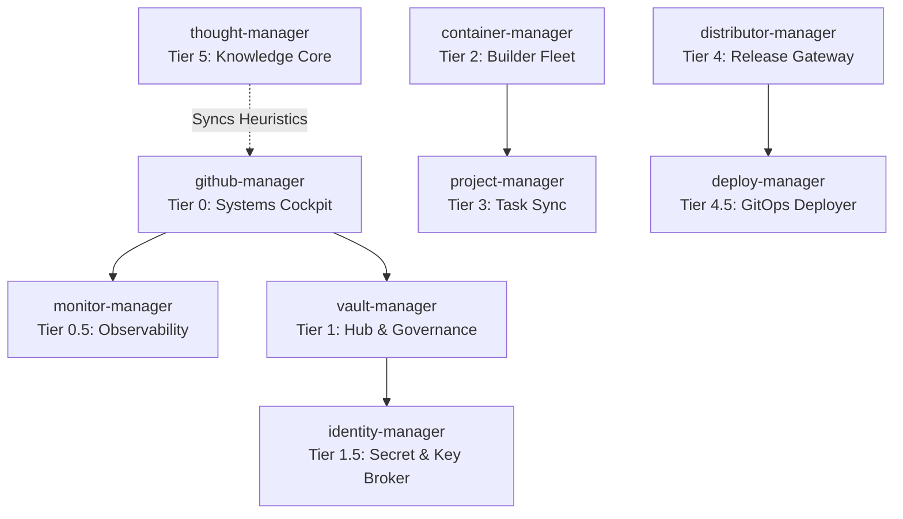

# 🌐 GitHub Manager — Tier 0: Systems Control Cockpit

Welcome to the **github-manager** command center. This repository serves as the Tier 0 global orchestration hub and digital nervous system for the **RPDevs-Vault** organization, overseeing a fleet of 260+ repositories and automated workflows.

---

## 🏛️ Manager Fleet Architecture

The management infrastructure of the RPDevs-Vault is organized into a tiered system to separate governance, package compilation, task tracking, distribution, and global health monitoring:

| Manager | Role / Tier | Key Functions | Repository Link |
| :--- | :--- | :--- | :--- |
| **`github-manager`** | **Tier 0 (The Cockpit)** | Global health dashboard, self-hosted runner configurations, API limit telemetry, runner monitoring. | [github-manager](https://github.com/RPDevs-Vault/github-manager) |
| **`monitor-manager`** | **Tier 0.5 (Observability)** | Active connectivity probes, endpoint ping heartbeats, push notifications. | [monitor-manager](https://github.com/RPDevs-Vault/monitor-manager) |
| **`vault-manager`** | **Tier 1 (The Hub)** | Org governance, automated daily fork sync, merged branch cleanup, issue label standardization. | [vault-manager](https://github.com/RPDevs-Vault/vault-manager) |
| **`identity-manager`** | **Tier 1.5 (Secret Broker)** | JSON schemas for environment variables, Age/FIDO2 setup guides, keys registry. | [identity-manager](https://github.com/RPDevs-Vault/identity-manager) |
| **`container-manager`** | **Tier 2 (The Builder)** | Compilation registry, multi-platform Docker builds, OCI package mirroring, ccache. | [container-manager](https://github.com/RPDevs-Vault/container-manager) |
| **`project-manager`** | **Tier 3 (The Sync)** | Local workstation project scanner, org-wide issue collector, active task dashboard. | [project-manager](https://github.com/RPDevs-Vault/project-manager) |
| **`distributor-manager`** | **Tier 4 (The Release)** | Final artifact publishing, release generation, changelog assembly. | [distributor-manager](https://github.com/RPDevs-Vault/distributor-manager) |
| **`deploy-manager`** | **Tier 4.5 (The GitOps)** | Ansible provisioner playbooks, docker-compose runtime mappings, rolling deploy trigger. | [deploy-manager](https://github.com/RPDevs-Vault/deploy-manager) |
| **`thought-manager`** | **Tier 5 (The Thought)** | ADR archive, custom agent skillbooks, implementation markdown templates. | [thought-manager](https://github.com/RPDevs-Vault/thought-manager) |

---

## 📡 Live System Health Dashboard

The section below is automatically compiled and updated every 6 hours by the [Global Health Dashboard](.github/workflows/global-health.yml) workflow utilizing `aggregate_health.py`.

<!-- HEALTH_DASHBOARD_START -->

Last Updated: `2026-07-03 13:20:42 UTC`

### 🔑 API Rate Limits
- **Core Rate Limit:** `4992/5000` (99.8% remaining)
- **Reset Time:** `14:10:13 UTC`

### 🖥️ Self-Hosted Runner Fleet
#### `RPDevs-Vault` Runner Fleet
| Runner Name | OS | Status | Labels |
| :--- | :--- | :--- | :--- |
| `local-runner-01` | Linux | 🔴 Offline | `X64, local, linux64` |

### 📦 Manager Workflows Health (RPDevs-Vault)
| Repository | Workflow | Status | Conclusion | Run Link | Last Run |
| :--- | :--- | :--- | :--- | :--- | :--- |
| `vault-manager` | .github/workflows/archive-engine.yml | ❌ `completed` | `failure` | [Run #12](https://github.com/RPDevs-Vault/vault-manager/actions/runs/28650299065) | 2026-07-03 09:04 UTC |
| `vault-manager` | .github/workflows/health-dashboard.yml | ❌ `completed` | `failure` | [Run #11](https://github.com/RPDevs-Vault/vault-manager/actions/runs/28650298579) | 2026-07-03 09:04 UTC |
| `container-manager` | Base Image Builder | ❌ `completed` | `failure` | [Run #1](https://github.com/RPDevs-Vault/container-manager/actions/runs/28648997401) | 2026-07-03 08:40 UTC |
| `container-manager` | Docker Collector | ✅ `completed` | `success` | [Run #32](https://github.com/RPDevs-Vault/container-manager/actions/runs/28636565388) | 2026-07-03 03:33 UTC |
| `container-manager` | Fleet Status Aggregator | ✅ `completed` | `success` | [Run #14](https://github.com/RPDevs-Vault/container-manager/actions/runs/28659224802) | 2026-07-03 12:01 UTC |
| `github-manager` | Global Health Dashboard | 🔄 `in_progress` | `Running...` | [Run #3](https://github.com/RPDevs-Vault/github-manager/actions/runs/28663261141) | 2026-07-03 13:20 UTC |
| `project-manager` | Project Roadmap Sync | ✅ `completed` | `success` | [Run #1](https://github.com/RPDevs-Vault/project-manager/actions/runs/28648314960) | 2026-07-03 08:26 UTC |
| `monitor-manager` | Heartbeat Uptime Check | ✅ `completed` | `success` | [Run #1](https://github.com/RPDevs-Vault/monitor-manager/actions/runs/28659025071) | 2026-07-03 11:57 UTC |
| `deploy-manager` | *No runs discovered* | - | - | - | - |
| `distributor-manager` | *No runs discovered* | - | - | - | - |
| `identity-manager` | *No runs discovered* | - | - | - | - |

### 🛠️ Build Workflows Health (RPDevs-Builds)
| Repository | Workflow | Status | Conclusion | Run Link | Last Run |
| :--- | :--- | :--- | :--- | :--- | :--- |
| `kodi-build` | Automated Workspace Housekeeping | ❌ `completed` | `cancelled` | [Run #3](https://github.com/RPDevs-Builds/kodi-build/actions/runs/28314592539) | 2026-06-29 07:04 UTC |
| `kodi-build` | Build and Release Depends | ❌ `completed` | `failure` | [Run #7](https://github.com/RPDevs-Builds/kodi-build/actions/runs/28567118572) | 2026-07-02 06:31 UTC |
| `kodi-build` | Build and Release Kodi | ❌ `completed` | `failure` | [Run #5](https://github.com/RPDevs-Builds/kodi-build/actions/runs/28635662384) | 2026-07-03 03:06 UTC |
| `xbmc-build` | Build and Dispatch Kodi Core | ❌ `completed` | `failure` | [Run #52](https://github.com/RPDevs-Builds/xbmc-build/actions/runs/27486695421) | 2026-06-14 04:40 UTC |
| `rpdevs-builds.github.io` | Deploy GitHub Pages | ✅ `completed` | `success` | [Run #80](https://github.com/RPDevs-Builds/rpdevs-builds.github.io/actions/runs/28659518523) | 2026-07-03 12:07 UTC |
| `script.service.megacloud` | Megacloud Auto-Sync & Build | ✅ `completed` | `success` | [Run #51](https://github.com/RPDevs-Builds/script.service.megacloud/actions/runs/28651393292) | 2026-07-03 09:25 UTC |
| `script.service.flaresolverr` | FlareSolverr Auto-Sync & Build | ✅ `completed` | `success` | [Run #26](https://github.com/RPDevs-Builds/script.service.flaresolverr/actions/runs/28634425926) | 2026-07-03 02:28 UTC |
| `nextdns-firefox-addon` | CodeQL | ✅ `completed` | `success` | [Run #73](https://github.com/RPDevs-Builds/nextdns-firefox-addon/actions/runs/28549944839) | 2026-07-01 21:49 UTC |
| `nextdns-firefox-addon` | Extension Pipeline | ✅ `completed` | `success` | [Run #91](https://github.com/RPDevs-Builds/nextdns-firefox-addon/actions/runs/28549944833) | 2026-07-01 21:48 UTC |
| `nextdns-firefox-addon` | github_actions in /. - Update #1444329787 | ✅ `completed` | `success` | [Run #25](https://github.com/RPDevs-Builds/nextdns-firefox-addon/actions/runs/28549917413) | 2026-07-01 21:48 UTC |
| `nextdns-firefox-addon` | github_actions in /. - Update #1446541275 | ✅ `completed` | `success` | [Run #26](https://github.com/RPDevs-Builds/nextdns-firefox-addon/actions/runs/28656149061) | 2026-07-03 10:59 UTC |
| `nextdns-firefox-addon` | npm_and_yarn in /. - Update #1446541271 | ✅ `completed` | `success` | [Run #27](https://github.com/RPDevs-Builds/nextdns-firefox-addon/actions/runs/28656149159) | 2026-07-03 10:59 UTC |
| `vlc-live-555` | Universal Cross-Platform Matrix Release Engine | ✅ `completed` | `success` | [Run #104](https://github.com/RPDevs-Builds/vlc-live-555/actions/runs/28649245286) | 2026-07-03 08:44 UTC |

<!-- HEALTH_DASHBOARD_END -->

---

## 🛠️ Advanced GitHub Features Leveraged

To manage the organization efficiently and prevent API rate-limiting while maintaining strict security, we utilize the following native features:

1. **Repository Dispatches (Event Framework):**
   - Instead of polling git repos for changes, `vault-manager` emits a `repository_dispatch` to `container-manager` on specific triggers, ensuring a push-based build chain.
2. **Organization-wide Repository Rulesets:**
   - Unified branch protection rules are applied org-wide (blocking force-pushes and deletions on `main` branches) to enforce codebase safety.
3. **GitHub Container Registry (GHCR):**
   - Hosting custom OCI images compiled by our `container-manager` builders directly within the organization package registry.
4. **Self-Hosted Runner Fleet:**
   - Deployed on dedicated infrastructure (`llmadmin` heavy/lite and `t430` medium/lite pools) with custom security configurations (`no-new-privileges:true`) and local caching (apt-cache, ccache).
5. **Secret Scanning & Dependabot Alerts:**
   - Continuous scanning of codebases for credential leaks and automated package upgrade PR generation.
