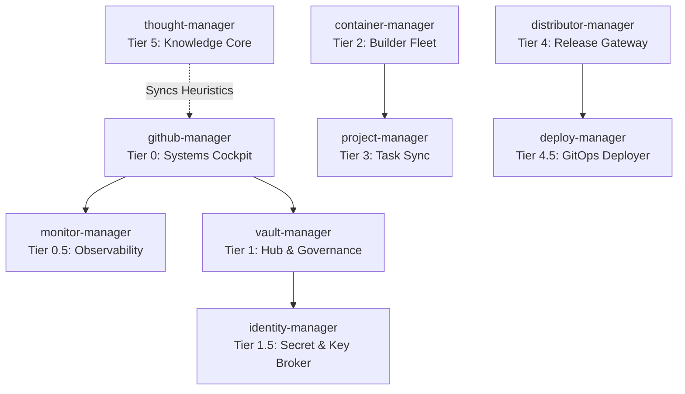

# 🌐 GitHub Manager — Tier 0: Systems Control Cockpit

Welcome to the **github-manager** command center. This repository serves as the Tier 0 global orchestration hub and digital nervous system for the **RPDevs-Vault** organization, overseeing a fleet of 260+ repositories and automated workflows.

---

## 🏛️ Manager Fleet Architecture

The management infrastructure of the RPDevs-Vault is organized into a tiered system to separate governance, package compilation, task tracking, distribution, and global health monitoring:

| Manager | Role / Tier | Key Functions | Repository Link |
| :--- | :--- | :--- | :--- |
| **`github-manager`** | **Tier 0 (The Cockpit)** | Global health dashboard, self-hosted runner configurations, API limit telemetry, runner monitoring. | [github-manager](https://github.com/RPDevs-Vault/github-manager) |
| **`monitor-manager`** | **Tier 0.5 (Observability)** | Active connectivity probes, endpoint ping heartbeats, push notifications. | [monitor-manager](https://github.com/RPDevs-Vault/monitor-manager) |
| **`vault-manager`** | **Tier 1 (The Hub)** | Org governance, automated daily fork sync, merged branch cleanup, issue label standardization. | [vault-manager](https://github.com/RPDevs-Vault/vault-manager) |
| **`identity-manager`** | **Tier 1.5 (Secret Broker)** | JSON schemas for environment variables, Age/FIDO2 setup guides, keys registry. | [identity-manager](https://github.com/RPDevs-Vault/identity-manager) |
| **`container-manager`** | **Tier 2 (The Builder)** | Compilation registry, multi-platform Docker builds, OCI package mirroring, ccache. | [container-manager](https://github.com/RPDevs-Vault/container-manager) |
| **`project-manager`** | **Tier 3 (The Sync)** | Local workstation project scanner, org-wide issue collector, active task dashboard. | [project-manager](https://github.com/RPDevs-Vault/project-manager) |
| **`distributor-manager`** | **Tier 4 (The Release)** | Final artifact publishing, release generation, changelog assembly. | [distributor-manager](https://github.com/RPDevs-Vault/distributor-manager) |
| **`deploy-manager`** | **Tier 4.5 (The GitOps)** | Ansible provisioner playbooks, docker-compose runtime mappings, rolling deploy trigger. | [deploy-manager](https://github.com/RPDevs-Vault/deploy-manager) |
| **`thought-manager`** | **Tier 5 (The Thought)** | ADR archive, custom agent skillbooks, implementation markdown templates. | [thought-manager](https://github.com/RPDevs-Vault/thought-manager) |

---

## 📡 Live System Health Dashboard

The section below is automatically compiled and updated every 6 hours by the [Global Health Dashboard](.github/workflows/global-health.yml) workflow utilizing `aggregate_health.py`.

<!-- HEALTH_DASHBOARD_START -->

Last Updated: `2026-07-08 04:50:37 UTC`

### 🔑 API Rate Limits
- **Core Rate Limit:** `4910/5000` (98.2% remaining)
- **Reset Time:** `05:15:12 UTC`

### 🖥️ Self-Hosted Runner Fleet
#### `RPDevs-Vault` Runner Fleet
| Runner Name | OS | Status | Labels |
| :--- | :--- | :--- | :--- |
| `llmadmin-vault-super-01` | Linux | 🟢 Online | `X64, linux64, lightweight, medium, heavy` |

#### `RPDevs-Builds` Runner Fleet
| Runner Name | OS | Status | Labels |
| :--- | :--- | :--- | :--- |
| `kodi-local-linux-v2` | Linux | 🔴 Offline | `X64, linux64` |
| `llmadmin-builds-super-01` | Linux | 🟢 Online | `X64, lightweight, linux64, medium, heavy` |

### 🌡️ Hardware Telemetry
| Hostname | CPU | Memory | Shared Disk | Temperatures | Last Updated |
| :--- | :--- | :--- | :--- | :--- | :--- |
| `llmadmin01` | 13.7% | 62.7% | 66.15% | acpitz: 25.0°C, nvme: 33.85°C, coretemp: 55.0°C, pch_cannonlake: 48.0°C, dell_smm: 60.0°C, iwlwifi_1: 48.0°C | 08:38:56 UTC |

### 📦 Manager Workflows Health (RPDevs-Vault)
| Repository | Workflow | Status | Conclusion | Run Link | Last Run |
| :--- | :--- | :--- | :--- | :--- | :--- |
| `ops-manager` | Global Health Dashboard | ✅ `completed` | `success` | [Run #1](https://github.com/RPDevs-Vault/ops-manager/actions/runs/28917453934) | 2026-07-08 04:26 UTC |
| `builder-manager` | *No runs discovered* | - | - | - | - |
| `delivery-manager` | *No runs discovered* | - | - | - | - |
| `workspace-manager` | Project Roadmap Sync | ✅ `completed` | `success` | [Run #1](https://github.com/RPDevs-Vault/workspace-manager/actions/runs/28917460294) | 2026-07-08 04:26 UTC |

### 🛠️ Build Workflows Health (RPDevs-Builds)
| Repository | Workflow | Status | Conclusion | Run Link | Last Run |
| :--- | :--- | :--- | :--- | :--- | :--- |
| `kodi-build` | Automated Workspace Housekeeping | ❌ `completed` | `cancelled` | [Run #4](https://github.com/RPDevs-Builds/kodi-build/actions/runs/28732305575) | 2026-07-06 06:42 UTC |
| `kodi-build` | Build and Release Depends | ❌ `completed` | `cancelled` | [Run #9](https://github.com/RPDevs-Builds/kodi-build/actions/runs/28906406911) | 2026-07-08 00:01 UTC |
| `kodi-build` | Build and Release Kodi | ❌ `completed` | `failure` | [Run #17](https://github.com/RPDevs-Builds/kodi-build/actions/runs/28689191934) | 2026-07-04 00:58 UTC |
| `xbmc-build` | Build and Dispatch Kodi Core | ❌ `completed` | `failure` | [Run #52](https://github.com/RPDevs-Builds/xbmc-build/actions/runs/27486695421) | 2026-06-14 04:40 UTC |
| `rpdevs-builds.github.io` | Deploy GitHub Pages | ✅ `completed` | `success` | [Run #126](https://github.com/RPDevs-Builds/rpdevs-builds.github.io/actions/runs/28916922864) | 2026-07-08 04:12 UTC |
| `script.service.megacloud` | Megacloud Auto-Sync & Build | ✅ `completed` | `success` | [Run #70](https://github.com/RPDevs-Builds/script.service.megacloud/actions/runs/28914840133) | 2026-07-08 03:15 UTC |
| `script.service.flaresolverr` | FlareSolverr Auto-Sync & Build | ✅ `completed` | `success` | [Run #31](https://github.com/RPDevs-Builds/script.service.flaresolverr/actions/runs/28912383667) | 2026-07-08 02:09 UTC |
| `nextdns-firefox-addon` | CodeQL | ✅ `completed` | `success` | [Run #74](https://github.com/RPDevs-Builds/nextdns-firefox-addon/actions/runs/28770705035) | 2026-07-06 05:50 UTC |
| `nextdns-firefox-addon` | OpenSSF Scorecard | ✅ `completed` | `success` | [Run #41](https://github.com/RPDevs-Builds/nextdns-firefox-addon/actions/runs/28859701933) | 2026-07-07 10:34 UTC |
| `nextdns-firefox-addon` | github_actions in /. - Update #1446541275 | ✅ `completed` | `success` | [Run #26](https://github.com/RPDevs-Builds/nextdns-firefox-addon/actions/runs/28656149061) | 2026-07-03 10:59 UTC |
| `nextdns-firefox-addon` | npm_and_yarn in /. - Update #1446541271 | ✅ `completed` | `success` | [Run #27](https://github.com/RPDevs-Builds/nextdns-firefox-addon/actions/runs/28656149159) | 2026-07-03 10:59 UTC |
| `nextdns-firefox-addon` | npm_and_yarn in /. - Update #1448006917 | ✅ `completed` | `success` | [Run #28](https://github.com/RPDevs-Builds/nextdns-firefox-addon/actions/runs/28755908841) | 2026-07-05 21:45 UTC |
| `vlc-live-555` | Universal Cross-Platform Matrix Release Engine | ✅ `completed` | `success` | [Run #123](https://github.com/RPDevs-Builds/vlc-live-555/actions/runs/28910579959) | 2026-07-08 01:23 UTC |

<!-- HEALTH_DASHBOARD_END -->

---

## 🛠️ Advanced GitHub Features Leveraged

To manage the organization efficiently and prevent API rate-limiting while maintaining strict security, we utilize the following native features:

1. **Repository Dispatches (Event Framework):**
   - Instead of polling git repos for changes, `vault-manager` emits a `repository_dispatch` to `container-manager` on specific triggers, ensuring a push-based build chain.
2. **Organization-wide Repository Rulesets:**
   - Unified branch protection rules are applied org-wide (blocking force-pushes and deletions on `main` branches) to enforce codebase safety.
3. **GitHub Container Registry (GHCR):**
   - Hosting custom OCI images compiled by our `container-manager` builders directly within the organization package registry.
4. **Self-Hosted Runner Fleet:**
   - Deployed on dedicated infrastructure (`llmadmin` heavy/lite and `t430` medium/lite pools) with custom security configurations (`no-new-privileges:true`) and local caching (apt-cache, ccache).
5. **Secret Scanning & Dependabot Alerts:**
   - Continuous scanning of codebases for credential leaks and automated package upgrade PR generation.
